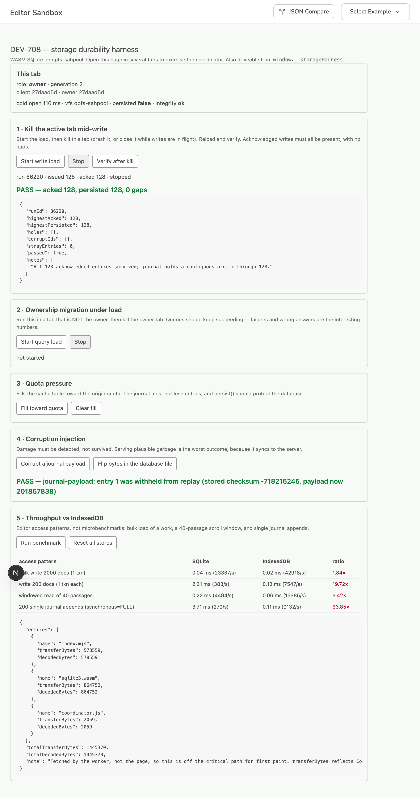

# DEV-708 — WASM SQLite storage stack: durability findings

**Verdict: proceed with the single-engine SQLite design. The journal-in-IndexedDB
fallback is not required.**

One caveat gates that verdict: **Safari is untested.** See [Not tested](#not-tested).

The spike asked whether the Notion-pattern storage architecture is durable enough
to hold the unsynced-edit journal, which during offline editing is the only copy
of a translator's work. Notion can treat its browser database as a cache; we
cannot. So the question was never throughput — it was whether an edit the storage
layer acknowledged is still there after the tab dies, and whether damage is
detected rather than served.

On Chromium and Firefox, it is.

---

## What was built

`libs/lib-persistence` — see its `README.md` for the architecture, and
`apps/web-editor/.claude/skills/verify-storage/SKILL.md` for how to re-run any of
this. The harness lives at `/storage` in `web-editor` and on
`window.__storageHarness`.

## How it was tested

|                  | Chromium 151                         | Firefox 153                  | Safari      |
| ---------------- | ------------------------------------ | ---------------------------- | ----------- |
| Driver           | Playwright + CDP                     | Playwright (genuine Gecko)   | **not run** |
| Tab kill         | real renderer crash (`Page.crash`)   | graceful close only — no CDP | —           |
| Quota exhaustion | real, quota lowered to 48 MB via CDP | not forceable                | —           |

Playwright's WebKit was deliberately **not** used. Its OPFS and SharedWorker
implementations are not Safari's, so a green WebKit run would be a false pass on
the engine most likely to fail.

Firefox's kill test is weaker than Chromium's: a graceful `close()` lets teardown
code run, so it does not prove what a crash proves. It is reported as the weaker
result it is.

## Results

### 1 · Kill the active tab mid-write — PASS

Journal entries are appended strictly sequentially, each tagged with a run id and
sequence number, so the expected post-crash state is exactly describable: a
contiguous prefix and nothing else. Any hole is silent partial state.

The oracle for "this edit was acknowledged" is a `localStorage` ledger written
after each append resolves. It can only lag the journal, never lead it, so it can
under-report loss but cannot raise a false alarm.

|                   | Chromium (real crash) | Firefox (graceful close) |
| ----------------- | --------------------- | ------------------------ |
| Acknowledged      | 153                   | 90                       |
| Persisted         | 153                   | 90                       |
| Gaps inside range | 0                     | 0                        |
| Failed checksums  | 0                     | 0                        |

Every acknowledged write survived. The revived tab took the database over in
about one second and reported `integrity_check` clean.

### 2 · Ownership migration under load — PASS (Chromium)

A second tab proxying queries through the owner, then the owner's renderer
crashed mid-flight.

- 32 issued, **32 succeeded, 0 failed, 0 wrong answers**
- The follower won the ownership lock and became owner
- `integrity_check` clean afterwards; a write/read round trip succeeded
- **Worst-case latency 10,020 ms**

That last number is the finding. 10 s is `CALL_TIMEOUT_MS` — the point at which a
hung call is taken as evidence the owner died. Correctness is fine (the call was
retried against the new owner and succeeded), but a user closing a window can
stall another window's query for ten seconds. See
[Issues for Phase 1](#issues-for-phase-1).

Firefox was checked for two-tab coordination but not migration-under-crash, since
it cannot be crashed on demand: owner/proxy roles were elected correctly and
26/26 proxied queries succeeded.

### 3 · Quota pressure — PASS

A desktop origin quota is a fraction of free disk, so filling to exhaustion is
not feasible; the quota was lowered to 48 MB over CDP to make the wall reachable.

- Journal **677 → 677 entries**, unchanged
- Fill stopped cleanly at 44.3 MB with `SQLITE_IOERR: disk I/O error`
- `integrity_check` clean afterwards

Hitting the quota produces an ordinary write error, not corruption, and the cache
filling up does not cost unsynced edits.

**But `navigator.storage.persist()` returned `false`** in both headless browsers.
The protection against the browser evicting the whole origin under pressure is
therefore _unverified_. Chromium grants persistence based on site engagement,
which headless has none of; Firefox prompts. This needs confirming in a real
profile — it is the difference between "the journal survives quota pressure" and
"the journal survives, unless the browser deletes the origin".

### 4 · Corruption injection — PASS

Two injection points, because they exercise different defences.

**Journal payload** (bytes flipped via SQL, database left structurally perfect —
the case SQLite's own integrity cannot see): detected by the per-entry CRC-32 in
both engines. The entry was _withheld from replay_ rather than returned as valid,
which is the property that matters — replaying a corrupt Yjs update would poison
the document it applied to.

**Database file** (768 bytes flipped across 12 sites in the OPFS file, VFS
paused): detected by `PRAGMA integrity_check` on re-open in both engines, with
concrete page-level errors. Never served as plausible garbage.

> A methodology note worth keeping. Earlier runs reported Firefox _failing_ to
> detect file corruption. That was the harness, not Firefox: a single 64-byte
> flip at the midpoint of the pool slot landed either in the slot's unused tail
> or in a free page, and `integrity_check` correctly does not validate
> unallocated pages. Spreading damage across 12 sites inside the live database
> fixed it. The injector now also reports `injected: false` when it fails to
> inflict damage, so a broken injector can never again read as a clean pass.

### 5 · Cost

Mean milliseconds per operation, 2,000 synthetic passage docs sized from the real
local database (mean 273 B content, 5.7 annotations/passage).

| Access pattern                      | Chromium SQLite | Chromium IDB | Firefox SQLite | Firefox IDB |
| ----------------------------------- | --------------- | ------------ | -------------- | ----------- |
| Bulk write 2,000 docs (1 txn)       | 0.040           | 0.022        | 0.053          | 0.025       |
| Write 200 docs (1 txn each)         | 2.520           | 0.136        | 0.840          | 0.110       |
| Windowed read, 40 passages          | 0.252           | 0.068        | 0.125          | 0.075       |
| Journal append (`synchronous=FULL`) | 3.637           | 0.110        | 1.030          | 0.115       |

Cold open: **109 ms** Chromium, **106 ms** Firefox.
WASM payload: **1.44 MB uncompressed** (865 KB `sqlite3.wasm`, 579 KB glue, 2 KB
coordinator), fetched _by the worker_, so it is off the critical path for first
paint — it delays the first query, not the first render.

In terms the product cares about:

- Caching a 2,000-passage work: **~80 ms** (Chromium), ~106 ms (Firefox).
- A 40-passage scroll window: **~10 ms** / ~5 ms.
- One offline edit: **~3.6 ms** / ~1.0 ms.

**On the 33× ratio for journal appends.** It is real, and it is mostly not a
SQLite tax — it is the price of durability. `synchronous = FULL` fsyncs at each
commit, which is the entire reason an acknowledged edit survives a crash.
IndexedDB is faster here because it promises less: browsers expose no durable
commit mode, so the baseline is measuring un-fsynced writes. The comparison is
durable against non-durable, not slow against fast. At 3.6 ms per debounced edit
the absolute cost is irrelevant.

Two further reasons the ratio overstates the gap: SQLite runs in a worker and
pays a `postMessage` round trip per call that the main-thread IndexedDB baseline
does not, and batching collapses it anyway — the same 2,000 writes cost 18.5× per
row one-at-a-time and 1.8× in a single transaction.

## Recommendation

**Proceed with one SQLite engine. Do not adopt the journal-in-IndexedDB
fallback.**

The fallback exists to buy durability that SQLite was feared not to provide. The
measurements say SQLite provides it: acknowledged writes survived real renderer
crashes with zero gaps, corruption is caught in both modes on both engines, and
quota exhaustion is a clean error. Adopting the fallback would trade away atomic
multi-store commits — the ability to record a sync and drop the journal entries
it covers in one transaction — in exchange for a write-ordering protocol that
either loses edits or replays them, and it would buy nothing that has been shown
to be missing.

The performance case is not close either: the durability-critical path costs
1–4 ms per edit, and bulk loads are within 2× of IndexedDB.

**This recommendation is contingent on the Safari run.** Safari is the engine
where OPFS and SharedWorker are most likely to behave differently, and it is the
one browser this spike could not exercise. Phase 0 should not be declared passed
until it is.

## Not tested

- **Safari ≥ 16.4 — the significant gap.** No automatable real Safari was
  available. `playwright-webkit` is not evidence. The harness is fully
  hand-drivable for exactly this reason; the verify skill has the steps. Note the
  Safari 16.4 floor is not arbitrary: it is the first Safari with module workers
  and SharedWorker together, and both are load-bearing here.
- **`navigator.storage.persist()` actually granted.** Returned `false` in both
  headless engines. Eviction protection is unverified.
- **Firefox under a real crash**, and Firefox ownership migration.
- **Real Yjs documents.** Blobs are synthetic bytes sized from the real database.
  Real docs accumulate CRDT history between compactions, so they will be larger —
  the throughput figures are an optimistic bound, not a worst case.
- **Long-running sessions.** Nothing here ran for more than a few minutes; journal
  growth and compaction over a real offline working session are untested.

## Issues for Phase 1 (DEV-562)

1. **10 s worst-case stall on ownership migration.** `CALL_TIMEOUT_MS` is the
   floor for noticing a dead owner. Either lower it, or add a liveness ping so a
   dead owner is detected without waiting for a call to time out.
2. **No recovery path when `open()` fails.** If the new owner cannot open the
   database it rejects inside the lock callback, the lock is released, no owner is
   ever elected, and every tab waits forever with no error. During development one
   run stalled in exactly this shape (not reproduced with the final code). This
   would present to a user as a silently frozen editor and needs an explicit
   failure path.
3. **One transient `SQLITE_CORRUPT` during an early migration run.** Seen once
   during a crash-under-load run, not reproduced afterwards. It surfaced as a
   thrown error, not bad data, so the loud-failure property held — but it is worth
   watching.
4. **`DebugApi` must not ship.** Destructive test-only operations; they are off
   `StorageApi` deliberately, and should be dropped or gated unless the torture
   scenarios become a permanent regression suite.
5. **Bundler workarounds are inherited cost.** Neither the SQLite WASM package nor
   the SharedWorker entry can go through Turbopack; both are pre-built into
   `public/` by `tools/build-storage-assets.mjs`, which is a manual step that
   `nx dev` does not run. Worth wiring into the app's build target.

## Bundler findings (useful beyond this spike)

- **`@sqlite.org/sqlite-wasm` cannot be bundled.** It contains
  `new Worker(new URL(proxyUri, import.meta.url))` for the plain OPFS VFS's async
  proxy, where `proxyUri` is runtime-only. The SAH pool VFS never executes it, but
  Turbopack and webpack both fail the build on the unresolvable dynamic import.
- **Turbopack does not compile `new SharedWorker(new URL('./x.ts', …))`.** It
  handles the dedicated-worker form but emits the SharedWorker entry into
  `_next/static/media` as a _raw_ file, so the browser receives TypeScript and
  fails to parse it. The symptom is subtle: the page loads, a tab still becomes
  `owner` via the Web Lock, but `ownerId` stays `null` and cross-tab proxying
  silently never works.
- `opfs-sahpool` keeps its files in an `.opaque` subdirectory of the VFS
  directory, each a fixed-size slot with a 4 KB header. The database occupies only
  a prefix of its slot.
